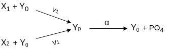
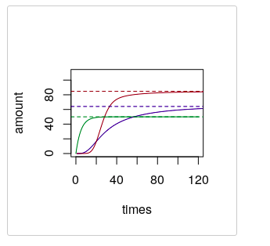

```{r setup, include=FALSE}
knitr::opts_chunk$set(echo = TRUE)
```

## Dynamic Systems

We consider dynamical systems D describing p (random) variables X taking value in $X = R_p$. They consist of a set of coupled first-order ordinary differential equations (ODEs) where the initial conditions $X^0$are exogenous random variables with a probability distribution $P^{X^0}$ that take value in $R_p$. That is

$$
\begin{align*}
X_i(t) &= f_i(X(t)),\\
X_i(0) &= X_0
i
, ∀i ∈ I
\end{align*}
$$
In this project, we worked on signal transduction network called protein kinase cascades. In a cell, first kinase X is activated by some external signal. This activated kinase X phosphrylates Kinase Y which in turn phosphorylates other kinase and chain continues. During this phoshorylation process, specific protein enzymes called phosphatases continually dephosphorylates the kinase by removing phosphoryl group. To study such a complex process, Alon Uri provided much simpler dynamic systems model as show in the below image:





This model uses simple first order kinetics to define the dynamic system. Here, rate equations for phoshorylated kinase $Y_p$ and unphoshorylated kinase $Y_o$ are given as below,


\begin{align*}
\frac{d Y_p}{dt} &= v_1X_1Y_o +v_2X_2Y_o -\alpha Y_p\\
\\

\frac{d Y_o}{dt} &= -v_1X_1Y_o - v_2X_2Y_o +\alpha Y_p
\end{align*}


## Equilibrium and Why it is important?

Dynamic systems are at equilibrium when all the rate equations result to zero. In other words, value of variables do not change once the system reaches to equilibrium. Modelers are often interested in how an intervention causes a system to behave at equilibrium.  For example, in economics, there are differential equations that define the rate of change of price given supply and demand.  However, an economist is generally interested predicting the effect of an intervention on supply (e.g., through a tariff) will affect the price of a product at equilibrium, they are less concerned with predicting exactly how the intervention will cause the price to fluctuate before reaching equilibrium.



Above image shows equilibrium values for Mapk.

## How to represent equilibrium state using SCMs?
We can create SCM from differential equations by setting the equations of motion to zero. Applying this method to our pathway model we get following SCM,

\begin{align*}
Y_p &= \frac{v_1X_1Y_o +v_2X_2Y_o}{\alpha}\\
\\
Y_o &= \frac{\alpha Y_p}{v_1X_1 +v_2X_2}\\
\end{align*}

## Introduction to Causal Constraint Model
To understand Causal Constraint Model, we will consider following system,


According to CCM paper, the solution space of any dynamic system can be constraint by three types of constraints,

1. At equilibrium system is at reset and all time derivatives must be equal to zero, unless the variable is intervened.
2. Conservation law, which means sum of two or more variables remains constant or sum of two or more time derivatives is zero. This constraint is valid unless one the variables is intervened.
3. A system may contain (derived) variables whose time-derivative does not depend on itself, This constraint is valid unless one the variables is intervened.

CCM models all three types of constraints as a set of triplets $(f_k, c_k, A_k)$,
Where $f_k$ is a function, $c_k$ is a constant and $A_k$ is a set of intervention targets under which this constraint is active. Now, for the above model we can derive CCM as follows,

1. $(k_0 + k_{\_1}C-k_1SE, \quad 0, \quad \mathcal{P}(\mathcal{I} \setminus\{S\}))$
2. $(k_1SE - (k_2 + k_{\_1})C, \quad 0, \quad \mathcal{P}(\mathcal{I} \setminus\{C\}))$
3. $(-k_1SE + (k_2 + k_{\_1})C, \quad 0, \quad \mathcal{P}(\mathcal{I} \setminus\{E\}))$
4. $(k_2C - k_3P, \quad 0, \quad \mathcal{P}(\mathcal{I} \setminus\{P\}))$
5. $(C+E-c_0-e_0, \quad 0, \quad \mathcal{P}(\mathcal{I} \setminus\{C, E\}))$
5. $(S-E-(s_0-e_0), \quad 0, \quad \{\{C\}, \{C, P\}\})$

To find the equilibrium state under intervention $do(I)$ we first figure out all the active constraints such that $I\in A_k$ and solve those equations to find solution.

## Solution of our model
In our model, we have two rate equations which give following causal constraints 
\begin{align*}
v_1X_1Y_o +v_2X_2Y_o -\alpha Y_p, & \quad 0, &\{\emptyset, Y_0\} \\
-v_1X_1Y_o - v_2X_2Y_o +\alpha Y_p, & \quad 0, &\{\emptyset, Y_p\}
\end{align*}

And from the conservation law, we get the following constraint
\begin{align*}
Y_o + Y_p- Y_T, & \quad 0, &\{\emptyset\}
\end{align*}

Using above causal constraint model, we get following values for equilibrium for different interventions.

| Intervention | $Y_p$ | $Y_0$ |
|----------------|-----------------------------------------------------------------------|---------------------------------------------------------|
| $\emptyset$ |$Y_T\frac{w_1X_1+w_1X_2}{1+ w_1X_1+w_1X_2}$| $Y_T\frac{1}{1+ w_1X_1+w_1X_2}$ |
| $do(Y_o = y_o)$ |$\frac{v_1X_1y_0+v_1X_2y_0}{\alpha}$|$y_o$|
| $do(Y_p = y_p)$ |$y_p$  | $\frac{\alpha y_p}{v_1X_1+v_2X_2}$ |
| $do(Y_o = y_o, Y_p = y_p)$ | $y_p$ |  $y_o$|
